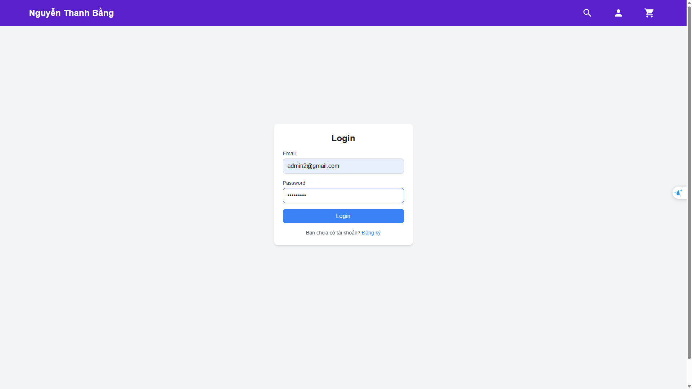
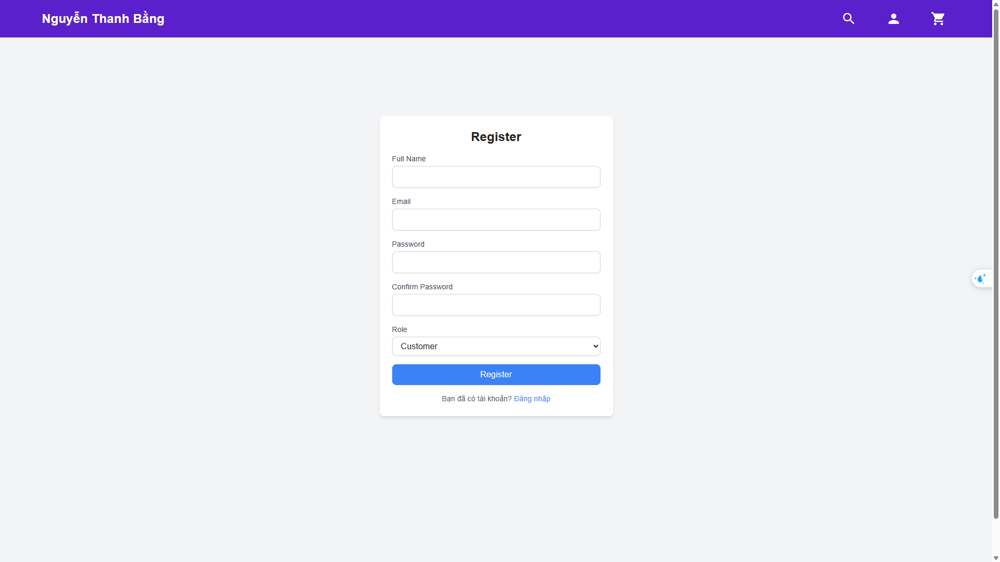
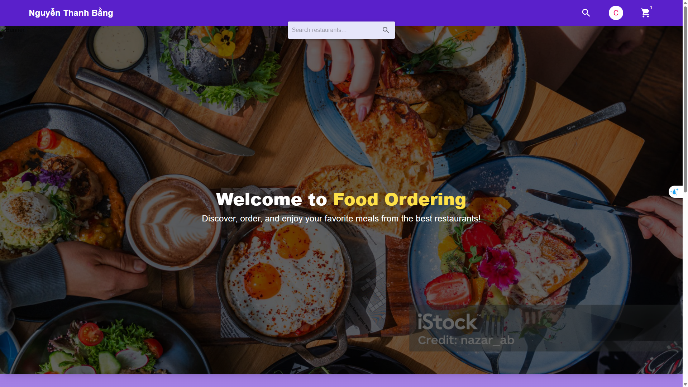
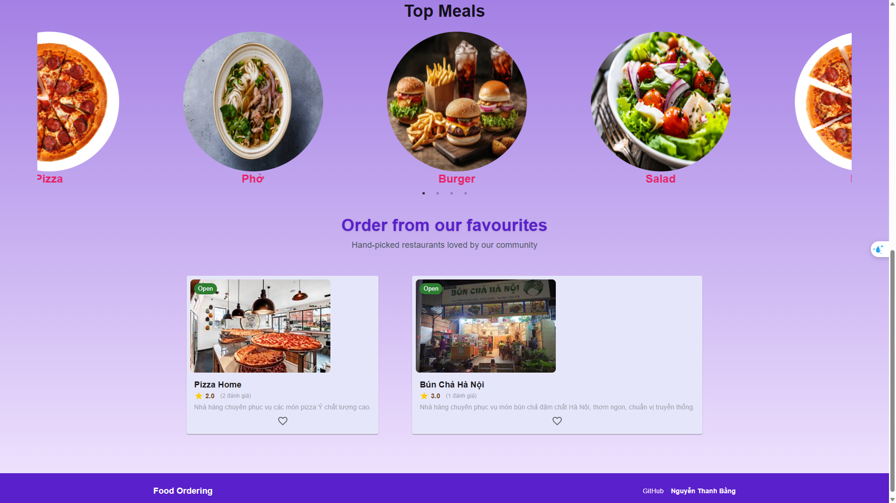
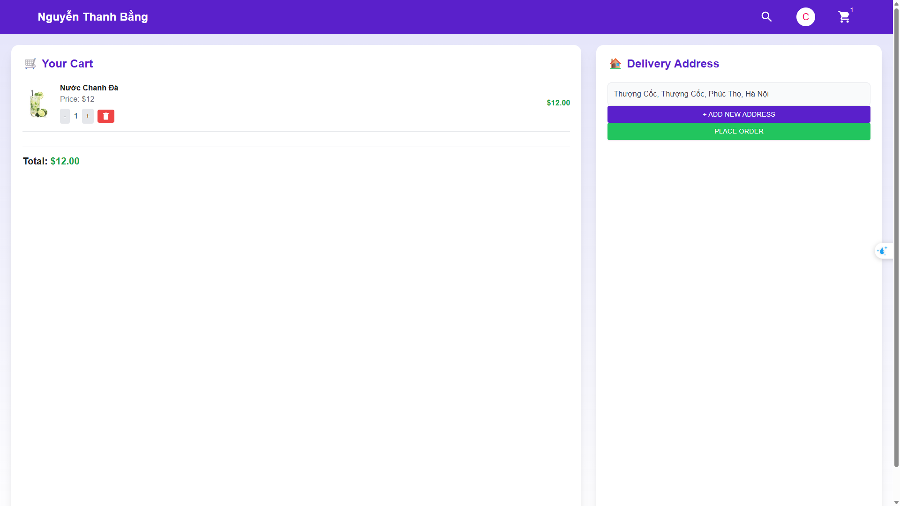
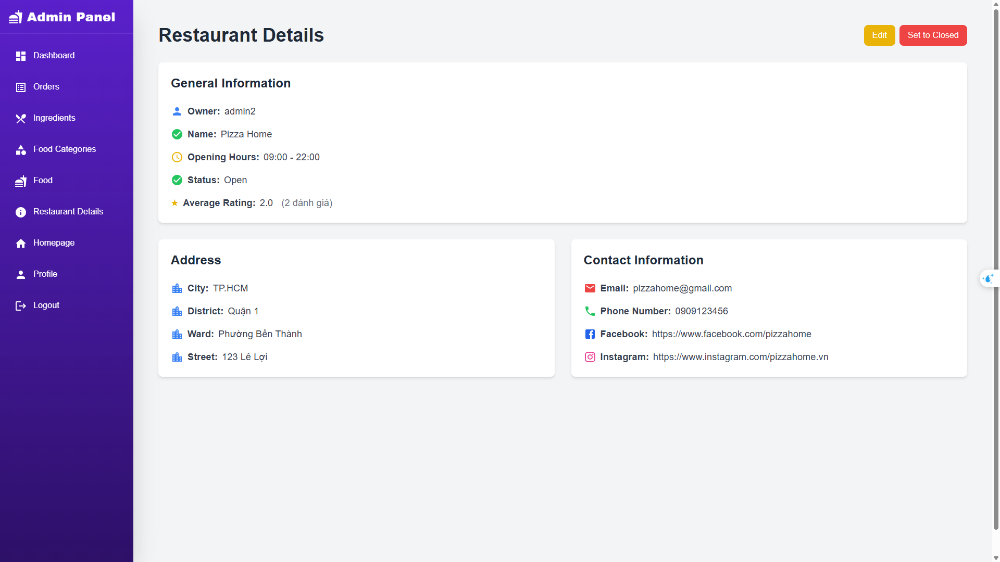
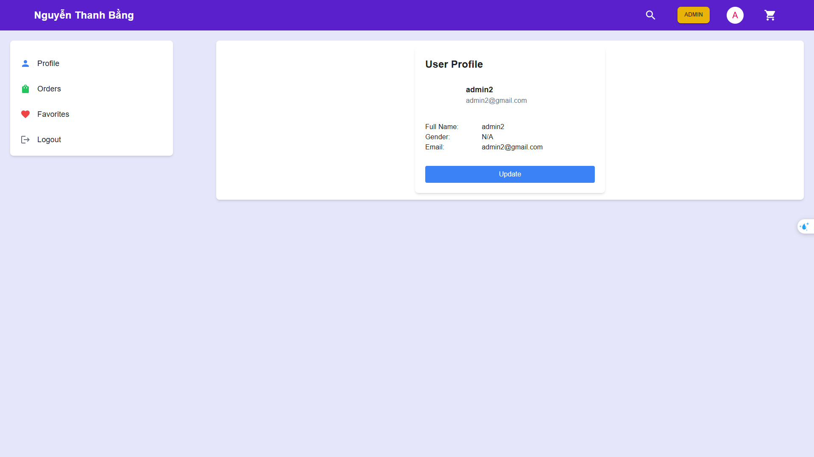
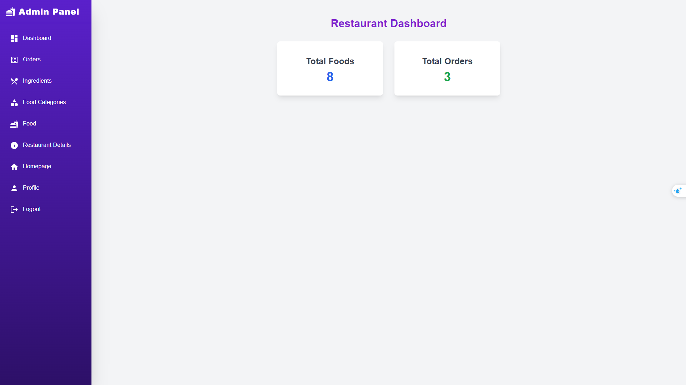
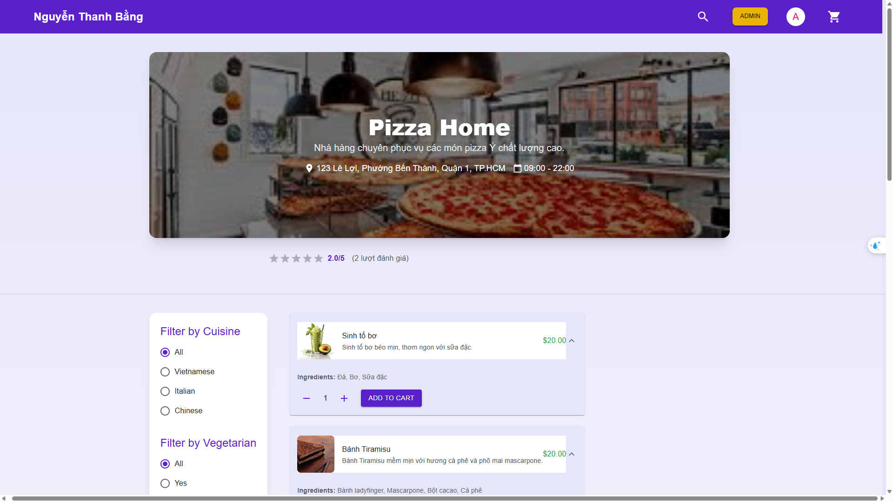
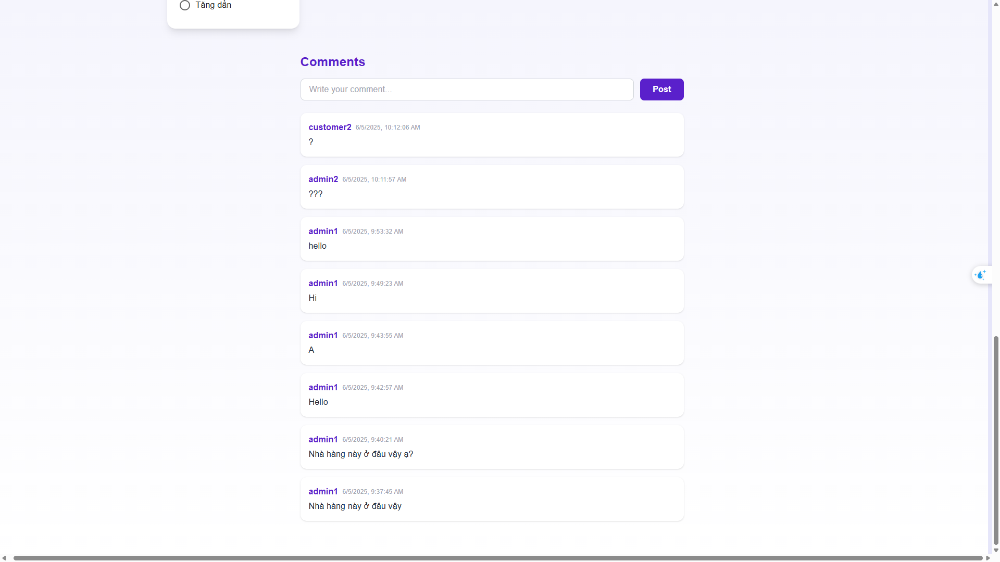

# food-ordering - Project developed by **Nguyễn Thanh Bằng**

### 1. Introduction

The Food Ordering system is a full-stack web application that allows users to conveniently browse restaurants, order food online, and track their orders. It also provides restaurant owners with powerful tools to manage menus, handle orders.
This project is built with modern technologies such as Java Spring Boot for the backend and ReactJS for the frontend, providing a responsive and user-friendly experience.
### 2. Features

#### 🢁 User

* Register, login, logout.
* Update and view personal information.
* View the list of restaurants and search by keyword.
* View restaurant details, menus.
* Add items to cart, update quantity, remove items.
* Place orders and track order history.
* Rate and comment on restaurants after using the service.
* Add restaurants to the favorites list.
* Filter restaurants and pagination.
#### 🍽️ Restaurant Owner

* Create, update restaurants.
* Manage restaurant status (closed / open).
* View statistics on orders, foods.
* Manage menu: categories, food items, item availability (available / sold out).
* Manage ingredients for each food item.
* View and process restaurant orders.

#### 📄 File Upload System

* Upload images for food items or restaurants.
---

### 3. 🛠️ Technologies Used

#### Backend

* **Java 17**
* **Spring Boot 3.2.2**
* Spring Web, Spring Security, Spring Data JPA
* Spring Validation, Spring WebSocket
* **MySQL** as the database
* **Lombok** for reducing boilerplate code

#### Frontend

* **ReactJS**
* React Router DOM, Axios, Context API, useReducer...
* Material UI, Bootstrap (or other UI libraries)

#### Others

* WebSocket for real-time order status updates
* RESTful API for frontend-backend communication

---
### 4.Project Structure
foodordering/  
├── backend/  
│   ├── src/  
│   │   ├── main/  
│   │   │   ├── java/  
│   │   │   │   └── com/nguyenthanhbang/foodordering/  
│   │   │   │       ├── config/  
│   │   │   │       ├── controller/  
│   │   │   │       ├── dto/  
│   │   │   │       ├── enums/  
│   │   │   │       ├── exception/  
│   │   │   │       ├── model/  
│   │   │   │       ├── repository/  
│   │   │   │       ├── service/  
│   │   │   │       ├── util/  
│   │   │   │       └── validator/  


### 5. 🚀 Project Setup Guide  

#### 5.1. Run Backend (Spring Boot)  

1. Install JDK 17 and Maven
2. Configure the database in the `application.properties` file:

```properties
spring.datasource.url=jdbc:mysql://localhost:3306/foodordering
spring.datasource.username=root
spring.datasource.password=your_password
```
3.Import the provided database structure using the foodordering.sql file:
- Open your MySQL client
- Execute the script in foodordering.sql to create and populate the necessary tables.
4. Start the application:

```bash
./mvnw spring-boot:run
```

#### 5.2. Run Frontend (React)  

1. Navigate to the frontend directory:

```bash
cd frontend
```

2. Install dependencies:

```bash
npm install
```

3. Start the React application:

```bash
npm start
```

---
#### 5.3. Account Test   
👤 Tài khoản người dùng (User):
- 📧 Email: `customer1@gmail.com`  
- 🔑 Mật khẩu: `Abcd1234!`  
- 📧 Email: `customer2@gmail.com`  
- 🔑 Mật khẩu: `Abcd1234!`  
  
🧑‍🍳 Tài khoản chủ nhà hàng (Restaurant Owner):
- 📧 Email: `admin1@gmail.com`  
- 🔑 Mật khẩu: `Abcd1234`  
- 📧 Email: `admin2@gmail.com`  
- 🔑 Mật khẩu: `Abcd1234`  

### 6. 📸 Demo  
  
#### 🔐 Login Page , Register Page  
  
  

#### 🏠 Homepage – Restaurant List  
  
  

#### 🛒 Cart  
  

#### 🍽️ Restaurant Detail  
  
  
#### 👤 Profile  

  
#### 🧑‍🍳 Admin Dashboard – Manage Restaurants  
  
  
#### 🌟 Review and Rating  
  
  

### 7. Contact  
  
> Project developed by **Nguyễn Thanh Bằng**  
> 📧 Email: [nguyenthanhbang2206@gmail.com](mailto:nguyenthanhbang2206@gmail.com)  
> 🗝 GitHub: [nguyenthanhbang2206](https://github.com/nguyenthanhbang2206)
